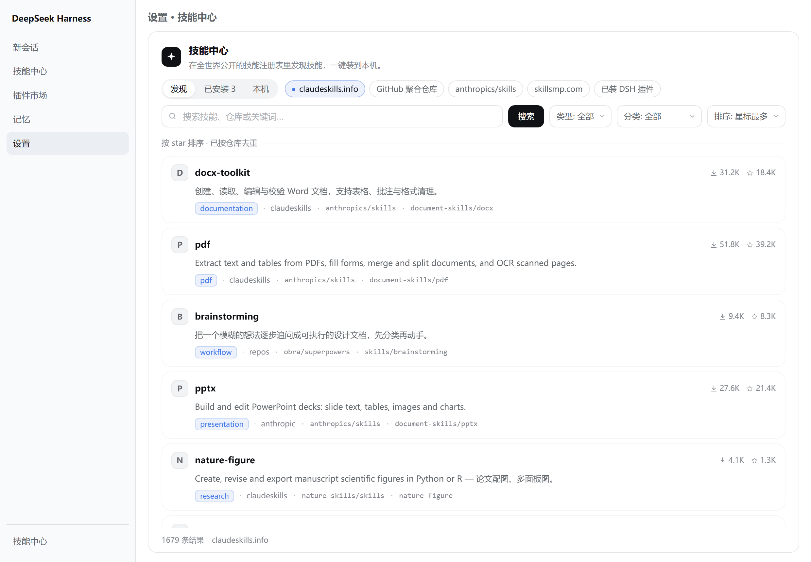
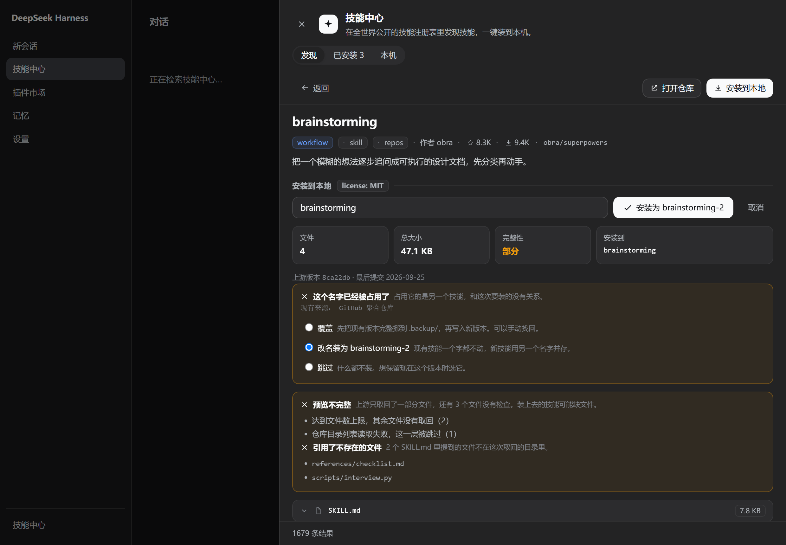
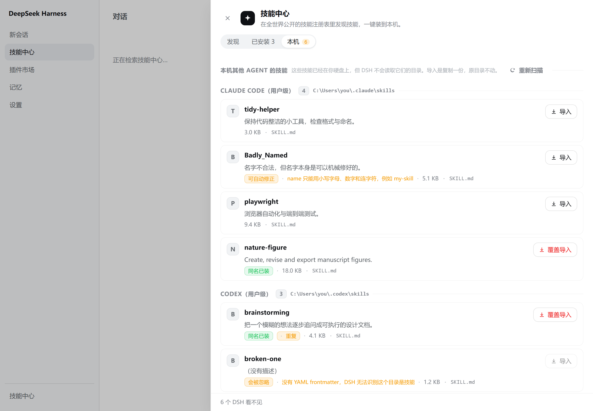
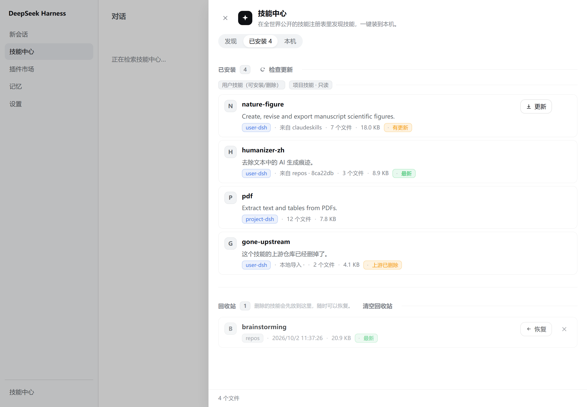
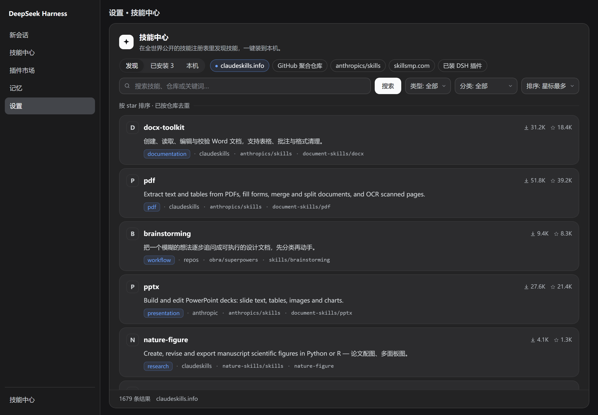

# 技能中心 · dsh-skill-center

一个 [DeepSeek Harness](https://github.com/deepseek-ai) 插件：在 Web GUI 里浏览、搜索、预览并安装**全世界公开的 Agent Skills**。

```powershell
dsh plugin --profile <你的 profile> add dsh-skill-center
```

装上之后侧边栏底部会多出一个「技能中心」按钮：



| | |
| --- | --- |
|  |  |
| **装之前把四种坏法说清楚** — 占名、缺件、不完整、名字不合法，各配自己的后果与选项 | **把 DSH 看不见的技能导进来** — 扫描 Claude Code / Codex / Agents / Gemini 的目录 |
|  |  |
| **装完之后看得见的状态** — 来路、更新检查与回收站 | **跟随 DSH 主题** — 颜色全走 `--dsw-alias-*` 令牌，没有第二套样式表 |

- **发现** — 聚合 5 个来源的技能目录，支持中英文关键词、分类、排序、分页
- **已安装** — 直接读你本机的 `~/.dsh/skills`，显示每个技能的来源、文件数与校验结果
- **本机** — 扫描 Claude Code / Codex / Agents / Gemini 的技能目录，把 DSH 看不见的技能导进来
- **详情 / 预览** — 看仓库目录树、读 `SKILL.md` 原文、逐个文件预览，确认后再落地
- **安装 / 删除** — 写入 `~/.dsh/skills/<name>/`，harness 的 chokidar 会立刻侦测到，**无需重启**

三个入口共用同一份状态：侧边栏按钮、`shell.overlay` 抽屉、设置页里的内联分区。

---

## 为什么不是又一个「技能列表」

技能**装得上**不等于 harness **会认它**。这个插件的大部分代码在处理两者之间的落差。

### 装之前先告诉你它会怎么坏

| 检查 | 不做的话会怎样 |
| --- | --- |
| **frontmatter 体检** | `name` 不合法（`PDF-Processing`、`my_pdf_tool`）的技能会被 harness **静默跳过**：装完看起来成功，列表里什么都没有。面板直接说「照现在这样装上去，DSH 会直接忽略它」，能给一键改写 `name:` 行的就修，修不了的（缺 frontmatter / 缺 description）**拒绝安装**而不是装作成功 |
| **完整性** | 一次 429 或超时会让仓库遍历半途而废。技能看起来干净，缺的却是它自己让模型去跑的脚本。详情页给「完整 / 部分」并列出停止取回的原因与条数 |
| **引用缺件** | `SKILL.md` 里 `` `scripts/build.py` `` 或 `[schema](references/schema.md)` 指向的文件如果不在取回的目录里，列出来。这类问题只在模型**第一次真用它**时才爆，而且爆在别人的任务中间 |
| **同名冲突** | 目标名字已被占用时**不静默覆盖、也不静默加 `-2`**——两者都是你事后才发现的性质。三个选项连后果一起摆出来：覆盖（先把现有版本完整挪进 `.backup/`）、改名装为 `pdf-2`、跳过。默认永远是不动现有的那个 |

### 装下来的就是那一次提交

安装读的是 **commit**，不是分支名：

```
一次请求  api.github.com/repos/{owner}/{repo}/commits/{branch}   → 拿到 commit SHA
一次请求  codeload.github.com/{owner}/{repo}/tar.gz/{sha}        → 整棵树，不可变
```

- **分支名是可变引用，commit 是不可变引用。** `raw.githubusercontent.com` 对分支名有 `max-age=300` 的 CDN 缓存，也就是说「刚才看是这版、五分钟后装下来是上一版」是可能的；按 SHA 取则缓存命中永远是对的。本项目自己就撞过这个坑：推完 README 立刻校验，读到的还是上一版。
- **详情页写着它是哪一版**：「上游版本 `8ca22db` · 最后提交 2026-09-25」。问不到版本时（匿名 API 配额是 60 次/小时）会明说「没能问到上游版本，这次抓的是分支当前内容」，而不是假装钉住了。
- **两条抓取路径都按 commit 读**。主路径是一次 codeload 归档；归档不可达时回落到逐文件抓取，但**回落也读那个 commit**，不是读分支——否则回执上会写着一个它从没读过的版本，下一次更新检查就会拿错东西去比。只有连 commit 都问不到时才会读分支，那种情况下回执不写版本，界面也照实说。
- **一次请求拿整棵树**，而不是每个文件一次：80 个文件就是 80 次请求，也更容易在中途失败。
- **读过的 commit 只下载一次**。键就是 commit，所以这条缓存**永远不会过期、也不需要失效**——换个版本是换了个键，不是这个键下的旧值。
- **二进制文件不再被写坏**。旧路径把所有内容按 UTF-8 解，技能里的 PNG / PDF 会被静默损坏；现在按字节判断，非文本走 base64 存盘。
- 解 tar.gz 是手写的约 60 行，用 Node 自带的 `zlib`，**运行时依赖仍然是 0**。

### 装完之后看得见的状态

- **来路**：每个装过的技能记住它来自哪个源、哪个仓库、哪条路径、**哪个 commit**，列表里直接显示
- **更新检查**：先问分支现在的 commit——**和记录里的一样就到此为止**，一个文件都不用下，且结论是确定的（同一个 commit 命名同一棵树）。不一样才去取那一版算整棵树的哈希：
  - 树也一样 → **最新**，同时把记录里的 commit 前移，下次检查又变回一次小请求
  - 树不一样 → **有更新**
  - 这是与旧行为最实质的差别：哈希从「只算 `SKILL.md`」变成**整棵树**，所以上游改一行 `scripts/*.py` 也瞒不过去——而这恰恰是技能最常被修的地方
  - 拿不到版本信息时会降级成只比 `SKILL.md`，并在结果里标出这次的结论只覆盖了文档（`depth: document`）
- **回收站**：删除是移进 `.trash/` 而不是抹掉，并弹出可撤销提示；被删的技能连同它的来路记录一起进桶，恢复后仍是「受管理」的技能
- **`.backup/`**：同名覆盖时上一版完整保留在 `<root>/.backup/<name>-<时间戳>/`

`.trash` 与 `.backup` 都带点前缀，是刻意的：harness 靠「目录里直接含 `SKILL.md`」判定技能，所以它两个都看不见，不会被当成技能列出来。

---

## 安装

已发布到 npm：[`dsh-skill-center`](https://www.npmjs.com/package/dsh-skill-center)

```powershell
dsh plugin --profile <你的 profile> add dsh-skill-center
```

包名会从 npm 上解析，和你装任何别的 DSH 插件是同一条路。桌面版自带 CLI 的路径随安装位置变化，
Windows 上在 `<安装目录>\resources\runtime\cli\bin\dsh.cmd`。

想改用源码（要改代码、或想跑本仓库里那套检查）：

```bash
git clone https://github.com/tuoLuoSuan/dsh-skill-center.git
dsh plugin --profile <你的 profile> add "<仓库路径>"
```

> **`--profile desktop` 会被普通 CLI 拒绝**（`profile "desktop" is managed exclusively by
> the Electron application`）。要让桌面版自己的 profile 生效，得用上面那条 Electron 附带的
> `dsh.cmd`，或者直接在应用内的插件管理界面里添加。

只要 profile 的 `package.json` 里 `dsh.profile.bundles` 有了本插件，且 `cordis.patch.yml`
是**纯 insert**（本仓库就是），就能热挂载，**不需要重启**。此后客户端代码改动同样热重载（刷新页面即可）；
`lib/` 下的宿主代码改动仍需要重启。

本包**没有任何运行时依赖**——`dependencies` 是空的，装下去的就是 `lib/`、`client/`、`locale/`
和两个清单文件，加起来 22 个文件 / 94.1 kB 打包（解包 319.9 kB）。对 `@deepseek-ai/dsh` 的依赖写在
`peerDependencies` 里（`>=0.2.0-rc.2`）并且标了 `optional`：它是一道**版本门禁**而不是要去安装的东西——
DSH 读这个字段来判断插件和当前运行时兼不兼容，pnpm 则因为 `optional` 不会去装第二份宿主。

### 怎么确认装上了

插件本身会告诉你它有没有活着，**不用去翻日志**：

1. **侧边栏底部**多出一个「技能中心」按钮（注册在 `sidebar.footer.action` 槽）。
2. 点开抽屉后，**左下角「发现」标签页里的来源轨**应当列出 5 个来源。**如果它报「宿主代码还是旧版本」，说明宿主那一半没加载**——`lib/` 是宿主代码，加完插件要重启一次 DeepSeek Harness，之后改 `client/` 才只需要刷新页面。
3. 面板底部的条数**必须是实时数**。这个数来自 `GET /dsh-skill-center/api/sources`，不写死；如果你看到的是 0 或一直转圈，是上游没连上，不是装错了——在浏览器里直接开 `http://127.0.0.1:<端口>/dsh-skill-center/api/sources` 就能看到原始 JSON 和真实错误。

`0.2.0-rc.2` 上验证过。更低版本会被上面那道版本门禁拦住（见「兼容性」）。

---

## 配置

在 profile 的插件配置里可选地提供：

| 键 | 默认值 | 说明 |
| --- | --- | --- |
| `dshHome` | `$DSH_HOME` 或 `~/.dsh` | 技能根目录的父目录 |
| `cacheDir` | `<dshHome>/skill-center/cache` | 上游响应缓存 |
| `trustedHosts` | `[]` | 反代/隧道场景下额外放行的 Host |
| `skillsmpApiKey` | 空 | 提高 skillsmp 的每日配额 |
| `agentHome` | 真实 OS home | 其他 agent 技能目录的父目录（测试用覆盖项） |

---

## 数据来源

| 来源 | 用途 | 需要密钥 |
| --- | --- | --- |
| [claudeskills.info](https://claudeskills.info) | 主枚举源，中文可搜 | 否 |
| [awesome-claude-skills](https://github.com/Chat2AnyLLM/awesome-claude-skills) | 仓库坐标表（repo + branch + path） | 否 |
| [anthropics/skills](https://github.com/anthropics/skills) | 官方技能仓库 | 否 |
| [skillsmp.com](https://skillsmp.com) | 搜索语料（匿名有每日配额） | 可选 |
| 已装 DSH 插件 | 各插件自带的技能包 | 否 |

正文一律经 `raw.githubusercontent.com` 取回（GitHub REST 未鉴权会 403，所以不用它）。

关于数字口径：claudeskills 的 `type=skill` **按仓库去重**后约 1,679 条，所以面板底部
显示的是这个数；条目总数（含 plugin / subagent / command / hook）与分类数会随时变动，
以 `GET /dsh-skill-center/api/sources` 的实时返回为准，不要在别处引用一个固定的总数。

---

## HTTP 接口

宿主侧把所有端点注册在**一条** `prefix` 路由 `/dsh-skill-center/api` 下：

| 方法 | 路径 | 说明 |
| --- | --- | --- |
| GET | `/sources` | 来源描述符 + 分类法 + 配额 + 已装计数 |
| GET | `/installed` | 扫描本机技能根，附来路记录、回收站条数与受管理计数 |
| GET | `/list` | `?source=&q=&kind=&category=&sort=&page=&limit=` |
| GET | `/agents` | 扫描其他 Agent 的技能目录（`~/.claude/skills` 等） |
| GET | `/trash` | 列出回收站 |
| GET | `/updates` | 对所有受管理技能做一次更新检查 |
| POST | `/item` | 取详情（含 `SKILL.md` 原文） |
| POST | `/preview` | 取待安装文件清单 + 体检 + 完整性 + 引用缺件 + 同名冲突 + `revision`（本次读的是哪个 commit） |
| POST | `/install` | 落地到 `~/.dsh/skills/<name>/`；`conflict` 取 `fail`（默认）/`skip`/`rename`/`replace` |
| POST | `/remove` | 移进回收站（仅限用户根，项目根只读）；`permanent: true` 才真删 |
| POST | `/restore` | 从回收站恢复，连来路记录一起接回去 |
| POST | `/purge` | 清空回收站（或其中一个桶） |
| POST | `/update` | 按来路记录重新拉取并覆盖安装 |
| POST | `/import-local` | 从发现的 agent 目录导入（复制，不是就地注册） |
| POST | `/read` | 读已安装技能正文 |

浏览器永远只跟宿主对话，**不直连上游**——所以没有 CORS 问题，密钥也不会到前端。

### 安全边界

- 每个请求（含 GET）都过同源校验：Host 缺失放行（非浏览器），Host 存在则必须是 loopback 或在 `trustedHosts` 里；`sec-fetch-site: cross-site` 直接拒；Origin 存在但解析失败也拒。
- 技能名必须匹配 `^[a-z0-9]+(?:-[a-z0-9]+)*$`；安装路径经 `containedChild` 校验，`../` 与绝对路径一律拒绝。
- 只写 `~/.dsh/skills`；项目根下的技能目录以 `writable: false` 呈现。
- `/import-local` **不信任客户端报上来的路径**：它重新扫描一遍 agent 目录，并要求请求里的路径确实出现在扫描结果里。否则这条路由就是一个任意文件读取原语。
- 导入是**复制**而不是把外部目录注册进来。就地注册的话，卸载本插件会连带删掉你的 Claude Code 配置，而且在 DSH 里编辑会改到别的 agent。

> 插件的 `exact`/`prefix` 路由注册在裸 `webServer` 上，**匹配优先于 DSH 自己的 `/api` 围栏**，围栏看不到它们——所以同源校验必须自己做。

---

## 开发

```bash
node docs/smoke-host.mjs       # 宿主半边：桩 cordis context + 真实 node:http + 真实上游
node docs/smoke-client.mjs     # 客户端半边：迷你 React + 桩 DOM + 桩 fetch
node docs/check-classes.mjs    # 样式表漂移：渲染出的 sc- 类是否都有定义
node docs/check-sorts.mjs      # 各源的排序键是否真的排了序（需要联网）
node docs/preview.mjs          # 把真实 bundle 渲染成 HTML，再用 Chrome 无头截图
node docs/preview.mjs --no-shot
node docs/audit-publish.mjs    # 发布前自检：账号名残留与写死的绝对路径
node docs/check-published.mjs  # 陌生人此刻在 GitHub 上看到的到底是什么（读 API）
                               # 匿名配额只有 60 次/小时；设 GITHUB_TOKEN 可提高
                               # 退出码 0=全过 1=有失败 2=有项目没查成（网络/配额）
node docs/look-at-page.mjs     # 上面那一页渲染出来好不好看（读 HTML，不是 API）
node docs/shot-page.mjs        # 把那一页真的截一张图下来，自己看一眼
node docs/verify-clone.mjs     # clone 一份公开仓库，验证陌生人的 checkout 真的能用
node docs/probe-npm-install.mjs  # 从 npm 装进一个用完就删的 profile，验证陌生人那条路能用
                                 # （不带参数时装 registry 上的版本；给个路径则装本地 tarball）
node docs/probe-sources.mjs    # 各上游可达性与契约实测
node docs/probe-validate.mjs   # frontmatter 体检与改名的往返
node docs/probe-references.mjs # SKILL.md 引用扫描的误报/漏报
node docs/probe-agents.mjs     # 其他 Agent 技能目录的发现结果
node docs/probe-tarball.mjs    # tar.gz 解码器（合成包 + 一个真实仓库）
node docs/probe-freshness.mjs  # 按 commit 钉住、整棵树比对与缓存命中（真实网络）
node docs/probe-glass.mjs      # 玻璃主题下这块面板还是不是实心的（先跑一次 preview.mjs）
```

两个冒烟测试都不碰真实的 `~/.dsh/skills`（宿主测试写进 `mkdtemp` 临时目录）。
`docs/preview.mjs` 需要 Chrome 或 Edge；找不到时会打印一行并跳过截图（不失败）。
浏览器不在默认位置就用 `SKILL_CENTER_CHROME=<可执行文件路径>`。

`docs/theme.css` 和几份 slot / service 目录 JSON 是从 DeepSeek 自己的 bundle 里抽出来的，
**没有提交进仓库**（`node docs/theme-tokens.mjs`、`node docs/extract-slot-catalog.mjs`
可以对着你自己的安装重新生成）——所以全新 clone 直接跑 `preview.mjs` 之前，先跑一次
`theme-tokens.mjs`。

`docs/verify-clone.mjs` 就是把上面这件事反过来验一遍：它 clone 一份公开仓库到临时目录，
跑一遍裸 clone 上应当通过的检查，确认没有哪个文件只存在于作者的机器上（生成的产物忘了提交、
只在本机存在的路径、假设了兄弟目录的脚本）。**它检验的是「别人拿到这个仓库能不能用」，不是
「作者的机器上能不能用」**——两件事不一样，这个脚本存在的唯一理由就是它们不一样。
（它自己踩过两个坑：`spawnSync` 的 `cwd` 指向尚未创建的目录会报 `ENOENT`，看起来像
"git 没装"；把子进程输出接进管道需要一个具名管道，而沙箱会拒绝，失败以 `result.error`
上的 EPERM 抵达、stdout 为空——与"运行成功但没输出"无法区分。所以它用
`stdio: 'inherit'`，并在 `result.error` 上显式报错。）

`dsh.cmd` 是一层两行的壳，真正的可执行文件是 Electron 自己（`ELECTRON_RUN_AS_NODE=1` 加一段
asar 里的 JS）。`probe-npm-install.mjs` 直接调那个二进制而不是 `.cmd`——Node 拒绝在没有 shell 的
情况下 spawn `.cmd`（`EINVAL`），而走 shell 就要给一个含空格的路径加引号。它顺便回答一个
发布前必须问的问题：**宿主拿到的是一个插件，还是第二份它自己**（后者正是 `@deepseek-ai/dsh`
写进 `peerDependencies` 的副作用，所以那一项标了 `optional`）。

改动 `lib/` 下的宿主代码后需要**重启 harness** 才生效；`client/client.js` 由
`@deepseek-ai/dsh-client-hmr` 轮询热重载，保存即可看到。

> 本仓库的脚本和文档含中文，**不要用 PowerShell 的 `Get-Content`/`Set-Content` 做
> 文本替换**——Windows PowerShell 5.1 会按 ANSI 代码页往返，把多字节字符压成
> `U+FFFD`。用编辑工具，或用 Node 读写 `utf8`。

### 预览回路

`docs/preview.mjs` 是改界面时的主要反馈回路：它在 Node 里求值一遍真实的
`client/client.js`，用桩 DOM / 桩 fetch 驱动真实交互（点侧边栏按钮开抽屉、点卡片
进详情、点安装出确认面板），输出 10 个场景 × 明暗两套的 HTML 与 PNG，**不需要重启
harness 就能看到界面**。它顺带发现过两处夹具错误（`counts` 形状、`/item` 响应形状）、
一处夹具缺口（`/updates` 少顶层 `checkedAt`，页脚渲染成 `Invalid Date`）与一处真 bug
（完整性提示拼错了字段），值得在改渲染函数后先跑它。

**这块面板不在玻璃主题下让路。** 壁纸类插件把宿主变透明的办法，是把
`--dsw-alias-bg-layer-*` 这几个别名重写成 `color-mix(…, transparent)`；凡是拿这些别名
当自己背景的面，壁纸就会透上来。对话气泡透一点没问题，一张罗列文件树的列表不行。所以
面板的颜色是**画在一块不透明底板上**的：`--sc-plate` 取自静态调色板
（`--dsw-static-neutral-bluish-*`，任何主题都不改写它），`--sc-solid` 再把主题底色叠在
它上面。没有玻璃主题时两层同色，等于什么都没改；有玻璃主题时面板仍是实心的。
`docs/probe-glass.mjs` 把这个约定变成断言：它不问壁纸插件在不在，只问「别名被别人改成
半透明之后，这块面还实不实」——并且先确认那次改写真的生效了，否则这个测试什么也没证明。

### 文件

- `lib/index.js` 宿主入口：路由与分发
- `lib/sources.js` 五个来源适配器
- `lib/github.js` GitHub URL 解析 / 目录列举 / 文件收集
- `lib/skills-dir.js` 技能根扫描、安装、回收站、备份、改名
- `lib/validate.js` `SKILL.md` 体检与 `name:` 行改写
- `lib/completeness.js` 「这次取回的文件树是否完整」
- `lib/references.js` `SKILL.md` 引用的文件是否存在
- `lib/tarball.js` 手解 tar.gz（一次请求拿到一个 commit 的整棵树）
- `lib/provenance.js` 安装来路记录（`<root>/.skill-center.json`），含整棵树的哈希
- `lib/updates.js` 按来路记录比对上游：先比 commit，必要时再比整棵树
- `lib/agents.js` 其他 Agent 技能目录的发现与导入
- `lib/frontmatter.js` `SKILL.md` frontmatter 解析
- `lib/http.js` `sendJson` / `readJsonBody` / `sameOrigin`
- `lib/net.js` 带超时、重试、缓存的上游抓取
- `client/client.js` 浏览器 bundle（手写 classic script，**无构建链**）
- `docs/mini-react.mjs` 迷你 React + `mount` / `renderHtml`，冒烟测试与预览共用

---

## 兼容性

面向 DSH `0.2.0-rc.2`。刻意**不使用** `@deepseek-ai/dsh-client-ui-primitives` 的任何导出，
也不 import `installSettingsSection` / `settingsNamespace`——前者在 0.1.7 会重命名图标，
后者在当前版本根本不存在，且**缺失的具名导入是模块求值期的 SyntaxError，会整棵插件树
一起崩掉**。图标全部内联 SVG，颜色一律走 `--dsw-alias-*` 令牌，因此自动跟随明暗主题。

**不要按 peer 自身的版本号写 `peerDependencies`**：DSH 的门禁是拿 range 去和 dsh 自己的
版本做 `semver.satisfies`，所以 `"@deepseek-ai/cordis": "~4.0.4"` 这种写法语义是错的。

想查某个 UI 插槽的契约：

```bash
node docs/extract-slot-catalog.mjs <你解包出来的 dsh-cordis-client-runner/lib/client.js>
node docs/show-slot.mjs sidebar.footer.action
```

### 视觉

视觉上刻意贴着 DSH 自己的设计系统走，而不是自带一套配色：

- DSH 基本是单色系统。`--dsw-alias-brand-primary` 浅色下是近黑 `#0f1115`、深色下是近白 `#f9fafb`，主按钮就是黑/白药丸；唯一成体系的彩色是 `--dsw-alias-link`（`deepseek-500` / `deepseek-400`）。所以皮肤的强调色只有这一处蓝，状态色只用 red / green / amber 令牌。
- **浅色下 `bg-base` / `bg-layer-1/2/3` 四个值全是纯白**，层次只能靠边框、遮罩与阴影做；深色下四层才真的分得开（950 / 875 / 850 / 800）。因此卡片用 `border-l1` 发丝边 + hover 才浮起，而不是给面板加底色。
- `--dsw-alias-bg-skeleton`、`--dsw-shadow-lv1/2/3`、`--dsw-font-*`、`--dsw-alias-markdown-*` 都直接复用，字号与圆角不自己发明。
- **别名令牌会随主题翻转，所以底色不翻转的组件不能用它上墨。** `--dsw-alias-toast-bg` 在浅色和深色下**都是深的**（`neutral-bluish-800` / `750`），而 `--dsw-alias-label-primary` 浅色下是近黑——两个凑一起就是黑底黑字。这个 bug 真出现过一次，而且只在浅色下可见，靠用户在真实界面里发现。给固定深色表面配字要用**永远为浅的调色板项**（`--dsw-static-neutral-bluish-00`），不是会翻转的别名；反过来，主按钮那种底色自己会翻转的地方（`button-primary-fill` + `label-primary-foreground`）就该成对用别名。
- 全部尺寸与颜色收敛在 `.sc-scope` 这一个作用域根的 CSS 变量里，主题切换不需要第二套样式表。

---

## 许可

[MIT](LICENSE)。插件本身不打包任何技能内容，安装时按需从上游取回；
各技能的许可条款以它自己的仓库为准（预览页会显示识别到的 `license` 字段）。
